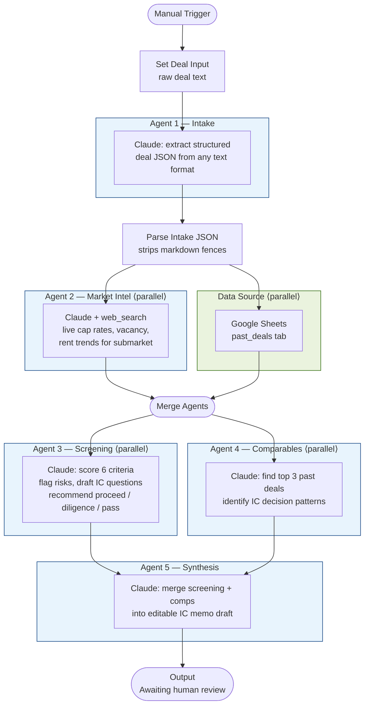
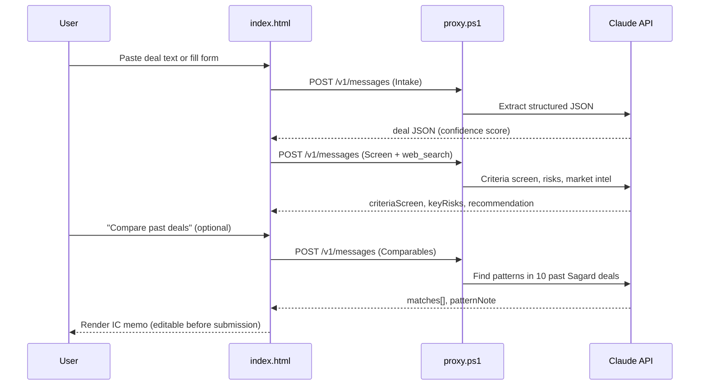

# Deal Digest —  Multiagentic Application for Real Estate Analysis, Market Research, comparison with on prem data and summarization (n8n)

> **AI-powered deal intake and investment screening** — paste a broker email or OM excerpt and get a structured IC memo in seconds.

Built for Sagard Real Estate ($5.2B AUM, formerly EverWest), Deal Digest turns unstructured deal text into a scored investment screen, live market intel, and comparable deal patterns — all reviewed by a human before submission to the Investment Committee.


---

## What it does

| Input | Output |
|-------|--------|
| Raw broker email, OM excerpt, or manual form | Structured deal JSON |
| Deal metrics + submarket | Live cap rate / vacancy / rent data (web search) |
| Current deal + past deal database | Top 3 comparable deals with pattern notes |
| All of the above | Scored criteria screen, risk flags, IC questions, editable memo |

---

## Agent architecture

The project ships as **two implementations** of the same multi-agent pipeline:

- **`index.html`** — standalone browser app with a local CORS proxy (no server required)
- **`deal_digest_n8n_final.json`** — importable n8n workflow for enterprise automation

### n8n workflow — 5-agent DAG



### Web app — 3-agent flow (browser)



---

## Agent descriptions

### Agent 1 — Intake
Reads any input format (email prose, OM bullet points, structured form data) and extracts a canonical deal object:

```json
{
  "deal_name": "Park Towers Industrial",
  "asset_type": "Industrial / Logistics",
  "location": "Denver, CO",
  "price_usd": 42500000,
  "noi_usd": 2380000,
  "cap_rate_pct": 5.60,
  "sqft": 285000,
  "occupancy_pct": 94,
  "walt_years": 4.2,
  "confidence": 0.91,
  "missing_fields": [],
  "inferred_fields": ["noi_usd"]
}
```

`confidence < 0.7` triggers a human confirmation gate (IF node in n8n, alert in the web app).

### Agent 2 — Market Intel
Uses Claude's `web_search_20250305` tool to pull **live** submarket data — current cap rate ranges, vacancy trends, rent growth — grounded with cited sources. Runs in parallel with the Google Sheets read to minimize latency.

### Agent 3 — Screening
Scores the deal against six Sagard investment criteria and returns a structured verdict:

| Criterion | Status |
|-----------|--------|
| Cap rate vs. market | pass / warn / fail |
| Market tier / location | pass / warn / fail |
| Asset class quality | pass / warn / fail |
| Lease duration (WALT) | pass / warn / fail |
| Occupancy rate | pass / warn / fail |
| Tenant credit / concentration | pass / warn / fail |

Also produces `keyRisks[]` (severity: high / medium / low), a `recommendation` (`proceed_to_ic` / `more_diligence` / `pass`), and `icQuestions[]` for the committee.

### Agent 4 — Comparables
Scores the current deal against the past-deals database and surfaces the 3 most relevant prior transactions. Identifies patterns in IC decisions — what got approved, what got killed, and why. Example output:

> **Central Connection (Denver, CO)** — high similarity. IC overrode WALT concern because I-25/I-76/I-270 location is irreplaceable. *Lesson: location quality can justify short duration in top-tier submarkets.*

### Agent 5 — Synthesis
Merges the screening verdict and comparables analysis into a structured IC memo draft ready for analyst review and editing before committee submission.

---

## Features

- **Paste anything** — broker emails, OM excerpts, raw notes; the intake agent normalizes it all
- **Live market data** — web search at inference time, not a stale dataset
- **Pattern memory** — 10 past Sagard / EverWest deals (publicly recorded) used as comparables
- **Human-in-the-loop** — memo is editable before IC submission; workflow halts at the review gate
- **Parallel execution** — Market Intel and Google Sheets run concurrently; Screening and Comparables run concurrently (total latency ≈ 2 serial hops, not 5)
- **Confidence scoring** — intake agent flags low-confidence extractions for human review
- **Two deployment targets** — zero-infrastructure browser app OR enterprise n8n automation

---

## Repo structure

```
deal-digest/
├── index.html                    # Standalone browser app (paste + screen + compare)
├── proxy.ps1                     # Local CORS proxy — keeps API key server-side
├── START.bat                     # Windows launcher: starts proxy then opens app
├── deal_digest_n8n_final.json    # n8n workflow — import via n8n → Workflows → Import
├── artifact-output.html          # Sample Claude artifact output (rendered in claude.ai)
├── docs/
│   └── screenshot.jpg            # Deal Scout output screenshot
└── README.md
```

---

## Quick start

### Option A — Browser app (no server, no n8n)

**Requirements:** Windows (proxy uses PowerShell), Anthropic API key

1. Clone the repo
2. Open `START.bat` — this starts `proxy.ps1` on `localhost:8080` and opens `index.html` in your default browser
3. Paste any deal text or fill the form fields
4. Click **Digest & screen →**

> The proxy forwards requests to `https://api.anthropic.com` and injects your API key server-side, keeping it out of browser network tabs.

To configure the API key, open `proxy.ps1` and set:

```powershell
$ApiKey = "YOUR_ANTHROPIC_API_KEY_HERE"
```

### Option B — n8n workflow (enterprise / scheduled)

**Requirements:** n8n instance, Anthropic API key, Google Sheets with a `past_deals` tab

1. In n8n, go to **Workflows → Import from file** and select `deal_digest_n8n_final.json`
2. In each **HTTP Request** node (Agents 1–5), replace the `x-api-key` header value with your key — or better, create a **Header Auth credential** named `Anthropic` and reference it
3. In the **Google Sheets** node, replace `YOUR_GOOGLE_SHEET_ID_HERE` with your Sheet ID (from the URL: `docs.google.com/spreadsheets/d/<ID>/`)
4. Set up Google Sheets OAuth2 credentials in n8n
5. Click **Execute workflow**

For production, replace the **Manual Trigger** with:
- **Webhook Trigger** — for Slack slash commands or inbound emails
- **Schedule Trigger** — for batch processing overnight deal flow
- **Email node** — to read inbound OM emails directly

#### Google Sheets `past_deals` schema

| Column | Type | Example |
|--------|------|---------|
| `name` | string | Central Connection |
| `loc` | string | Denver, CO |
| `year` | number | 2023 |
| `price` | number (M) | 67.0 |
| `cap` | number (%) | 5.20 |
| `sf` | number | 194710 |
| `outcome` | string | In portfolio |
| `notes` | string | Bought from JP Morgan below replacement cost... |

---

## Tech stack

| Layer | Technology |
|-------|------------|
| LLM | Claude (`claude-sonnet-4-6`) |
| Live market data | Claude `web_search_20250305` built-in tool |
| Workflow orchestration | n8n (self-hosted or cloud) |
| Browser app | Vanilla HTML/CSS/JS — no framework, no build step |
| Local API proxy | PowerShell HTTP listener |
| Past deals database | Google Sheets (n8n) / hardcoded JS array (web app) |

---

## Sample deal

The demo is pre-loaded with this deal:

> *Class A industrial portfolio of 3 buildings along Denver metro I-70 corridor. 94% leased with WALT of 4.2 years. Major tenants are regional distribution and e-commerce fulfillment companies. Recent cap-ex improvements to dock doors and HVAC. Seller is a private fund with wind-down timeline. Asking $42.5M at 5.60% cap rate, 285,000 SF, $149 per SF.*

Expected screening output: **Proceed to IC** with a warn on WALT duration and a risk flag on tenant credit/concentration (unnamed regional tenants).

---

## Design decisions

**Why a local proxy instead of calling the API from the browser directly?**
Browsers send all headers to DevTools. A local PowerShell proxy keeps the API key out of the network tab without requiring a deployed backend.

**Why parallel agent execution?**
Market Intel (web search, ~3–5 s) and Google Sheets read (~1–2 s) have no dependency on each other. Running them in parallel and merging before the screening step saves ~3 s per deal. Same pattern for Screening + Comparables.

**Why hardcode past deals in the web app instead of fetching from Sheets?**
The browser demo is a zero-dependency artifact — no OAuth, no backend, no CORS issues with Sheets. The n8n workflow uses the live Sheets feed for production.

**Why editable fields on the IC memo?**
Analysts know things the model doesn't (sponsor relationship, off-market pricing context, fund mandate constraints). The UI makes it easy to correct or supplement before submission rather than treating AI output as final.

---

## Security notes


---

## Context

Sagard Real Estate (formerly EverWest Real Estate Investors) manages approximately $5.2B in assets under management across industrial, multifamily, and select alternative sectors in high-barrier U.S. markets. Past deal data used in this demo is drawn from publicly available transaction records.
